### 컴퓨터공학전공 2015108180 김기현

# FIFA 19 complet player dataset을 활용하여 선수 몸값 예측

### FIFA 19 게임 속 선수들의 몸값을 예측해봅시다!
- kaggle에서 제공하는 게임 FIFA 19 complet player dataset을 활용하여 선수의 특성을 활용해서 선수의 몸값을 예측합니다.
- 수업시간에 진행했던 PretictionUtil 라이브러리를 활용하여 진행합니다.
- 데이터 출처 : https://www.kaggle.com/karangadiya/fifa19


## 데이터 불러오기
------

데이터를 CSV파일로 보면 다음과 같습니다.
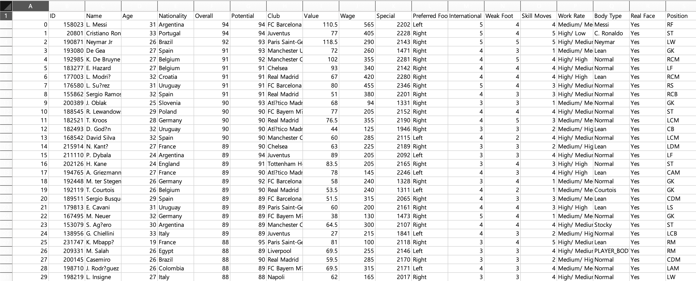

-----
이제 Pycharm에서 데이터를 불러오고 확인해봅시다.
```python
from prediction_util import PredictionUtil

class Project:
    gildong = PredictionUtil()

    df = gildong.read('fifa_data.csv')
    gildong.show_unique_column()
```
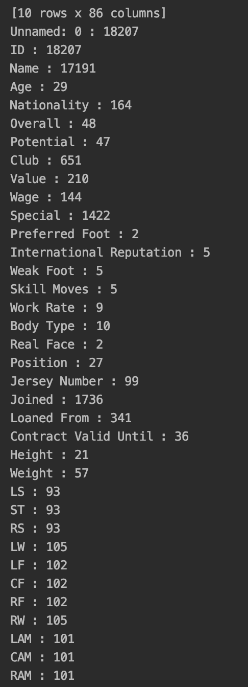

다음과 같이 데이터의 속성을 보여주고 있습니다.

----------

## 불필요한 데이터 제거
현재 데이터에는 ID, Name, Nationality 등과 같이 불필요한 데이터가 보입니다.
이러한 데이터를 삭제하도록 하겠습니다.

```python
gildong.drop(['ID', 'Name', 'Nationality', 'Club', 'Work Rate', 'Joined', 'Loaned From', 'Release Clause', 'Body Type', 'Real Face'])
```

-----
## 데이터 분석하기
- 이제 가져온 데이터를 이용하여 데이터를 분석하도록 하겠습니다.
- PredictionUtil 라이브러리에 있는 pairplots, lmplot, heatmap, plot_3d 등의 함수를 이용하여 그래프로 표현하도록 하겠습니다.
<br><br>
```python
gildong.heatmap(['Age', 'Overall', 'Potential', 'Height', 'Value'])
```

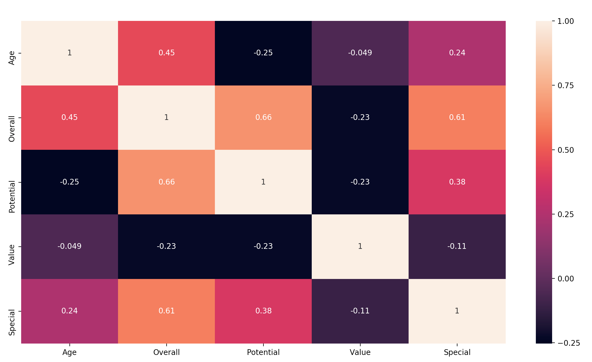
열지도의 결과 선수의 가치인 Value와 가장 높은 상관관계를 갖는 것은 Age였습니다. 가장 관계가 있을 것 같았던 Overall(능력치)은 상대적으로 영향을 많이 주지 않았고 Special이란 선수의 특별함이 보다 더 선수의 가치에 영향을 주는 것으로 보입니다.<br><br>

```python
gildong.lmplot('Value', 'Overall', 'Position')
```
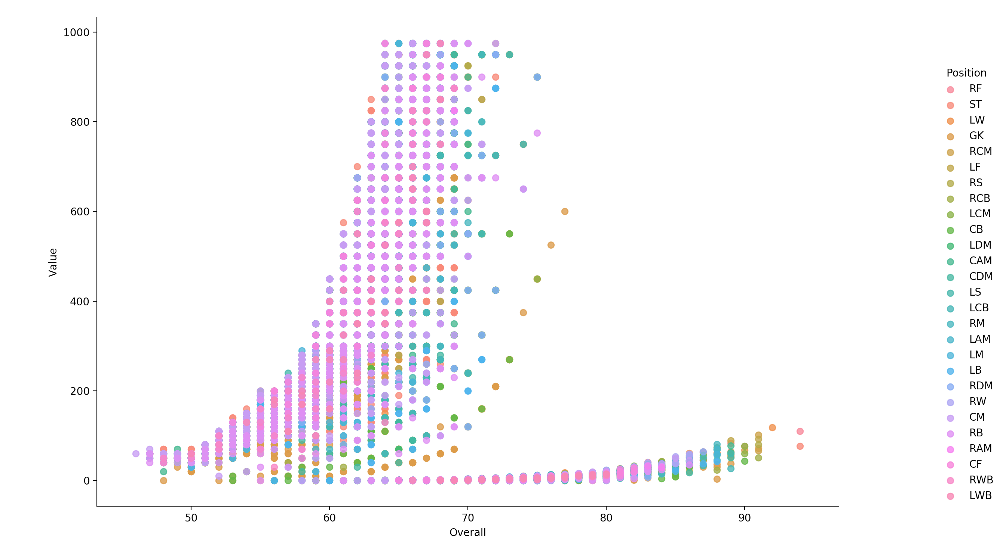

이 그림은 선수의 능력치에 따른 가치를 보여주는 그림입니다.<br>
포지션별로 나누었는데 상대적으로 공격수는 수비수보다 능력치가 낮아도 높은 가격에 거래되는 것을 볼 수 있습니다.
<br><br>

```python
gildong.boxplot('Age', 'Value')
```
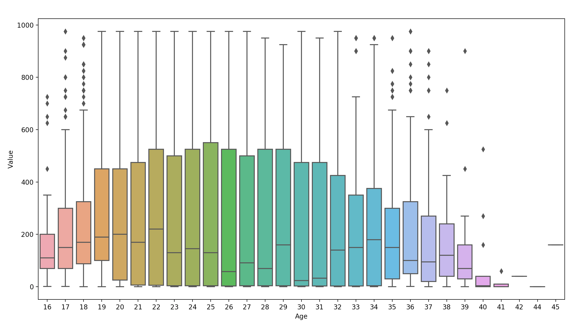
다음 그래프는 나이에 따른 선수의 가치를 보여주는 그래프입니다.


```python
gildong.boxplot('Height', 'Value')
```
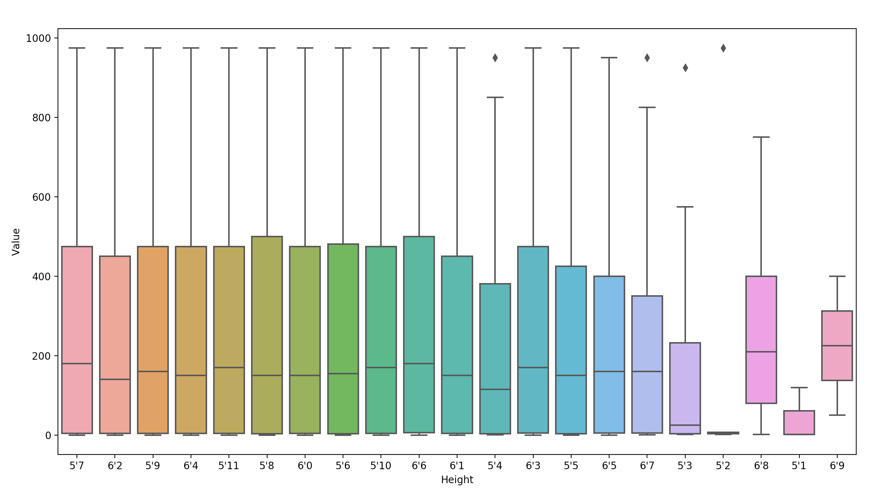
다음 그래프는 키에 따른 선수의 가치를 보여주는 그래프입니다. 축구 또한 키가 중요한 운동으로 키가 선수의 가치에 많은 영향을 줄 것이라 생각했는데 보이는 것처럼 고르게 분포하고 있습니다.


```python
gildong.plot_3d('Age', 'Overall', 'Value')
```
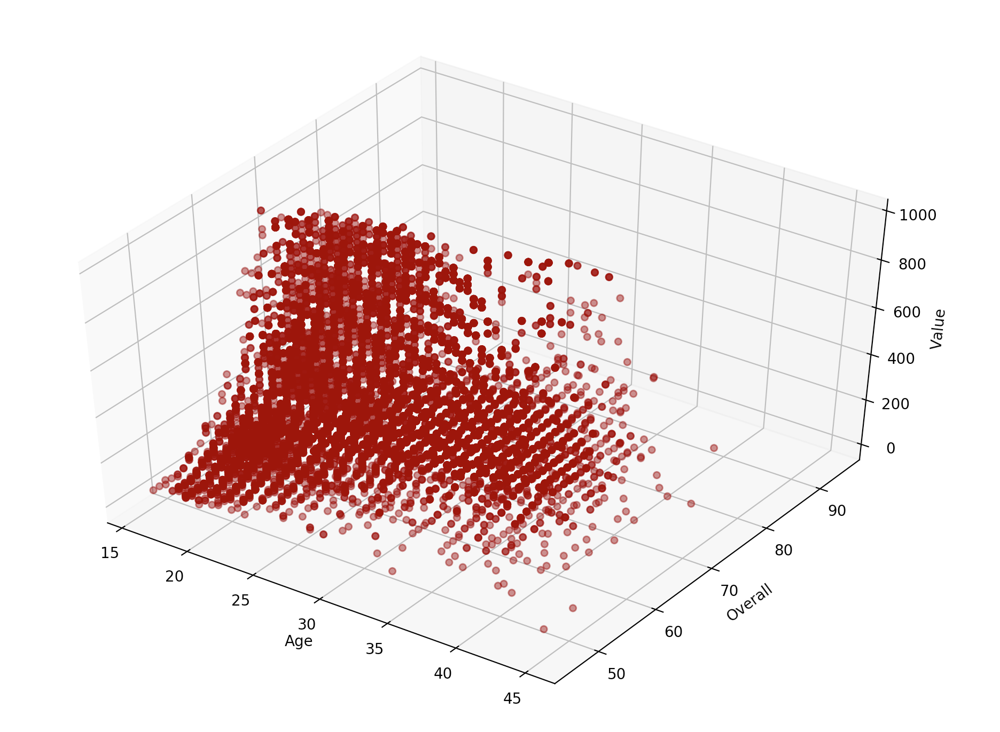
다음은 그래프를 보면 나이는 어릴수록, 능력치는 높을수록 선수의 가치가 높다는 것을 알 수 있습니다.


--------
## 데이터 학습 및 예측
- FIFA 19 게임 안에서 축구선수의 몸값을 나이, 능력치, 잠재성을 가지고 예측해보겠습니다.
- 능력치가 좋지 않더라도 게임 안에서 유저들이 선호하는 선수들의 몸값은 높을 수 있으므로 그 점은 감안해야 할 것 같습니다.

### 1. LinearRegression
```python
gildong.run_linear_regress(['Age', 'Overall', 'Potential'], 'Value')
```

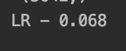

LinearRegression 방법으로 진행한 결과입니다. 그렇게 높아보이지는 않습니다.

### 2. KNeighborsRegressor
```python
gildong.run_kneighbor_regress(['Age', 'Overall', 'Potential'], 'Value')
```

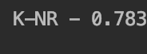

KNeighborsRegressor 방법으로 진행한 결과입니다. LinearRegressor 방법보다 확실히 좋아진 것이 눈에 보입니다.

### 3. DecisionTreeRegressor
```python
gildong.run_decision_tree(['Age', 'Overall', 'Potential'], 'Value')
```

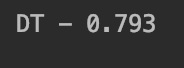

DecisionTreeRegressor 방법으로 진행한 결과입니다. KNeighborsRegressor 방법과 비슷한 수치로 나오고 있습니다.

### 4.RandomForestRegressor
```python
gildong.run_random_forest(['Age', 'Overall', 'Potential'], 'Value')
```

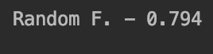

RandomForestRegressor 방법으로 진행한 결과입니다. 마찬가지로 비슷한 수치가 나오고 있습니다.


### 5. 4가지 방법 동시실행
```python
gildong.run_all(['Age', 'Overall', 'Potential'], 'Value')
```

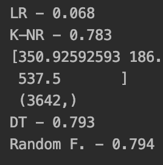

4가지 방법을 한번에 실행한 결과입니다. run_all 함수에는 LinearRegressor, KNeighborsRegressor, DecisionTreeRegressor, RandomForest 방법을 모두 실행할 수 있도록 되어있습니다. LinearRegressor 방법을 제외하고 나머지 3가지 방법에서는 비슷한 값을 보여주고 있습니다.
